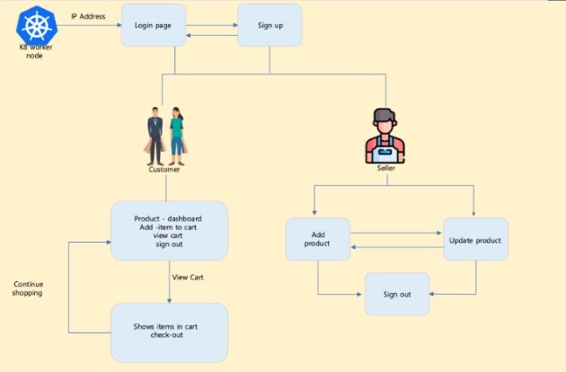
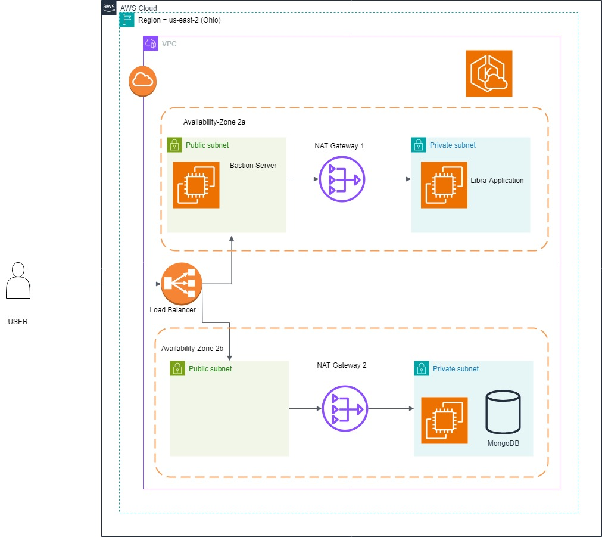

# Libra

Libra is a web application built using the Flask framework for API development, MongoDB as the database, and a front-end designed with HTML, CSS, and JavaScript. The platform allows users to sign up as customers or sellers, list products, add items to a cart, and complete purchases.
The objective of the application was to practice the the tools of devops from Docker, Kubernetes, CICD Pipeling.
## Features

- **User Authentication:** Signup/Login as a customer or seller.
- **Product Management:** Sellers can list products with descriptions and prices.
- **Shopping Cart:** Customers can add items to the cart and proceed to checkout.
- **REST API:** Backend services are built using Flask.
- **Database:** MongoDB is used to store the information.
- **Responsive UI:** Designed with HTML, CSS, and JavaScript.

## Project Workflow

1. **Application Development:** Building API endpoints using Flask.
2. **Dockerization:** Containerizing the application for portability.
3. **Deployment on Kubernetes:** 
   - On-Premise Kubernetes Cluster
   - AWS EKS (Elastic Kubernetes Service)
4. **CI/CD Pipeline:** Implemented using GitLab Runners.

## Architecture Overview

### Flow Diagram

### AWS Deployment Architecture

## CI/CD Pipeline
Libra uses GitLab CI/CD for automated builds, testing, and deployment. The pipeline:
- Builds and tests the application.
- Pushes the Docker image to a container registry.
- Deploys to the Kubernetes cluster.

## Terraform Scripts 
The Terraform scripts in the Terraform folder are used to spin up resources for an Amazon EKS cluster on AWS. These scripts provision a master node, worker node, and a VPC in the ap-northeast-3 region.
